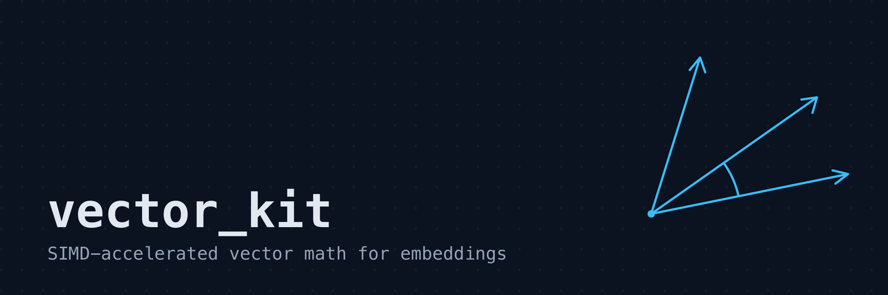
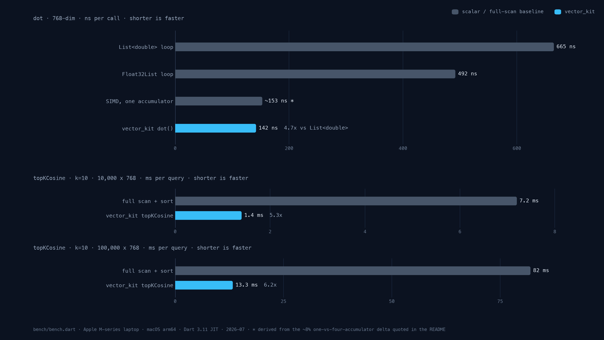

# vector_kit

SIMD-accelerated vector math for embeddings: dot product, cosine
similarity, normalization, and top-k search over packed matrices.

Embedding code in Dart usually ends in a plain double loop. Dart has
shipped SIMD types in `dart:typed_data` for years, but using
`Float32x4` correctly means alignment rules, scalar tails for lengths
that are not a multiple of four, and accumulator ordering. vector_kit
is that wiring as a pure Dart package with no runtime dependencies.

## Quick start

```dart
import 'dart:typed_data';

import 'package:vector_kit/vector_kit.dart';

void main() {
  final a = Float32List.fromList([1, 0, 2, 1]);
  final b = Float32List.fromList([2, 1, 1, 0]);
  print(dot(a, b)); // 4.0
  print(cosineSimilarity(a, b)); // 0.666...
  print(euclideanDistance(a, b)); // 2.0

  // Top-k search: pack the corpus once, query many times.
  final index = VectorMatrix(768);
  for (final embedding in embeddings) {
    index.add(embedding); // Float32List of length 768
  }
  for (final (row, score) in index.topKCosine(queryEmbedding, 10)) {
    print('row $row scores $score');
  }
}
```

A runnable version is in `example/vector_kit_example.dart`.

## Measured performance

From `bench/bench.dart` on an Apple M-series laptop, Dart 3.11, JIT
(`dart run bench/bench.dart`), 768-dimensional vectors:



| Workload                    | Baseline                          | vector_kit   | Speedup |
| --------------------------- | --------------------------------- | ------------ | ------- |
| dot, 1M calls               | 665 ns/call, `List<double>` loop  | 142 ns/call  | 4.7x    |
| dot, 1M calls               | 492 ns/call, `Float32List` loop   | 142 ns/call  | 3.5x    |
| topKCosine k=10, 10k rows   | 7.2 ms/query, full scan and sort  | 1.4 ms/query | 5.3x    |
| topKCosine k=10, 100k rows  | 82.0 ms/query, full scan and sort | 13.3 ms/query| 6.2x    |

Compiled ahead of time (`dart compile exe`) the same benchmark gives
126 ns/call for dot and 1.0 / 10.5 ms/query for the two top-k
workloads. The four independent accumulators in the dot kernel are
worth about 8 percent over a single accumulator under the JIT and 14
percent compiled; the benchmark measures both variants. Run the
benchmark on your own hardware before relying on any of these
numbers.

The top-k gain over a full scan comes from three things: one SIMD dot
product per row over a single packed buffer, L2 norms precomputed when
rows are added, and a bounded min-heap instead of sorting all scores.

## What is inside

Functions over `Float32List`:

| Function              | Notes                                          |
| --------------------- | ---------------------------------------------- |
| `dot(a, b)`           | four `Float32x4` accumulators, scalar tail     |
| `cosineSimilarity`    | clamped to `[-1, 1]`, rejects zero vectors     |
| `euclideanDistance`   | L2 distance                                    |
| `normalizeInPlace(v)` | scales `v` to unit norm, rejects zero vectors  |
| `normalized(v)`       | same, but returns a copy                       |

`VectorMatrix` stores rows back to back in one `Float32List`, padded
to a multiple of four components so every row starts on a 16-byte
boundary. The search loops read the whole matrix through a single
`Float32x4List` view: no per-row alignment checks, no tails.

- `add(row)` copies the row in and caches its L2 norm.
- `topKCosine(query, k)`, `topKDot(query, k)`, and
  `topKEuclidean(query, k)` return `(index, score)` records, best
  first. For Euclidean the score is the distance, so smaller is
  better.
- `rowAt(index)` returns a live view into the storage, not a copy.
  Treat it as read-only: writing through it does not update the
  cached norm.
- `toBytes()` and `VectorMatrix.fromBytes(bytes)` serialize to a
  simple binary format: the ASCII magic `VKT1`, dimension and row
  count as little-endian uint32, then the float32 components in
  row-major order. Corrupt input throws `FormatException`.

## Validation

Every operation fails fast instead of letting a bad component poison
scores downstream: length mismatches, empty vectors, NaN or infinite
components, and zero vectors where the operation is undefined all
throw `ArgumentError` at the call site.

The finiteness check costs nothing on the hot path. A NaN or infinite
component always drives a multiply-add accumulation non-finite, and
infinities never cancel back to a finite value, so vector_kit only
rescans the inputs to locate the exact offending component when a
result comes back non-finite.

## Precision

Accumulation happens in `Float32x4` lanes, so results differ from an
exact double-precision sum. The test suite pins the difference to
within 1e-5 relative to the product of the input norms at dimensions
up to 1024. The scalar tail (the last `length % 4` components)
accumulates in double precision, so components tiny enough to
underflow float32 (below about 1e-38) can contribute or vanish
depending on their position; real embedding values are many orders of
magnitude above that floor. If you need double-precision
accumulation, this package is the wrong tool.

Inputs are accepted as any `Float32List`, including views. A view
that does not start on a 16-byte boundary is copied internally before
the SIMD loop; `normalizeInPlace` still writes the result back to the
original view.

## Relation to rag_kit

[rag_kit](https://github.com/Yusufihsangorgel/rag_kit) covers the
retrieval pipeline (chunking, embedding orchestration, context
building) and vector_kit is the numeric layer such a pipeline can sit
on; neither package depends on the other today.

## Planned

- Approximate nearest neighbor search (HNSW).
- int8 quantization for larger corpora.
- Isolate-parallel search for very large matrices.

These stay out until the exact-search core has settled.

## License

MIT.
